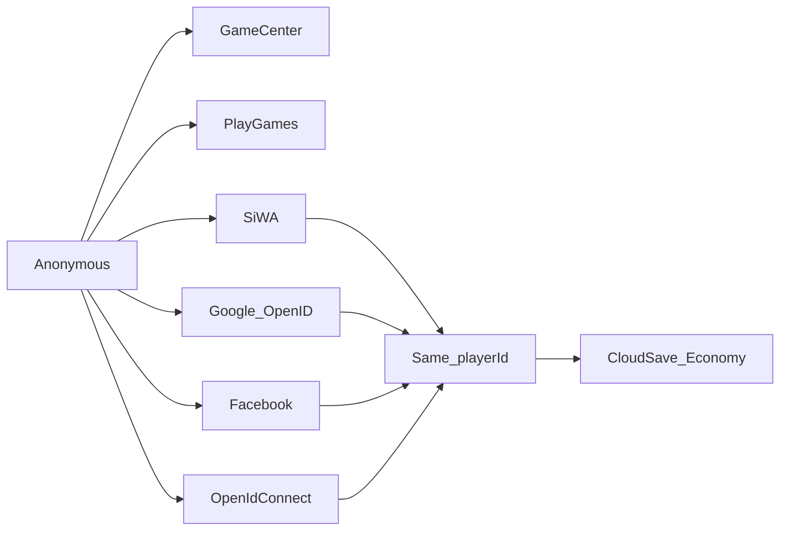

# Auth identities — Game Services vs Cloud

← [Back to README](../README.md) · [Auth](auth.md)

---

## Two layers

| Layer | `AuthPlatform` | Purpose |
|-------|----------------|---------|
| **Game services** | `AppleGameCenter`, `GooglePlayGames` | Achievements, native nick/avatar, store identity (OS-local) |
| **Cloud (portable)** | `Apple`, `Google`, `Facebook`, `OpenIdConnect` | Cross-device cloud save on the **same** UGS `playerId` |

Game Center and Google Play Games **do not** cross-link each other. Cross-save requires linking at least one portable IdP on both devices (e.g. Google OpenID on iOS + Android, or SiWA on both).



## `AuthPlatformKind`

```csharp
AuthPlatformKind.IsGameService(AuthPlatform.AppleGameCenter); // true
AuthPlatformKind.IsCloudIdentity(AuthPlatform.Google);        // true
AuthPlatformKind.GetExternalIdTypeId(AuthPlatform.Facebook);  // "facebook"
```

## API (no UI)

```csharp
IAuthService auth = GameServicesLocator.Services.Auth;

// Game services (one per OS)
await auth.LinkWithAccountAsync(AuthPlatform.AppleGameCenter);
await auth.LinkWithAccountAsync(AuthPlatform.GooglePlayGames);

// Portable cloud
await auth.LinkWithAccountAsync(AuthPlatform.Apple);    // SiWA token bridge
await auth.LinkWithAccountAsync(AuthPlatform.Google);   // Google id_token bridge
await auth.LinkWithAccountAsync(AuthPlatform.Facebook); // Facebook access token
await auth.LinkWithAccountAsync(AuthPlatform.OpenIdConnect); // Discord/Snap/… via config

auth.IsIdentityLinked(AuthPlatform.Google);
await auth.UnlinkWithAccountAsync(AuthPlatform.Apple);
```

## Credential bridges

```csharp
.WithAuthProviderCredentials(new GameServicesAuthProviderConfig
{
    // Game services
    RequestAppleGameCenterCredentialsAsync = ...,
    GooglePlayGamesOAuthWebClientId = "...",

    // Cloud
    AppleServicesId = "...",
    RequestAppleIdentityTokenAsync = ...,
    GoogleOpenIdWebClientId = "...",
    RequestGoogleIdTokenAsync = ...,
    FacebookAppId = "...",
    RequestFacebookAccessTokenAsync = ...,
    OpenIdConnectIdProviderName = "oidc-discord", // Dashboard name
    RequestOpenIdConnectIdTokenAsync = ...,
})
```

Native SDKs (Google Sign-In, Facebook Login, Snapchat, Discord OIDC, …) live in the **game**. This package only consumes tokens.

## After `LinkWithAccountAsync`

| Result | Game should |
|--------|-------------|
| `Linked` | Same player; optional import of display name/avatar from game service |
| `SignedIntoExisting` | Session is now another UGS player — **reload Cloud Save + Economy**, show Keep Local / Apply Cloud conflict if needed |
| `Cancelled` / `Failed` / `NotSignedIn` | Stay on current session; show error |

## UGS-native vs OIDC

| Provider | UGS first-class | Notes |
|----------|-----------------|-------|
| Apple SIWA | Yes | iOS + Android when token bridge set |
| Google OpenID | Yes | Distinct from Google Play Games |
| Facebook | Yes | USER access token |
| Game Center / GPGS | Yes | OS-gated |
| Discord / Snapchat / TikTok / X | Via **OpenID Connect** IdP in Dashboard | Use `AuthPlatform.OpenIdConnect` |

## Market notes (product)

- **Must:** Apple + Google OpenID (EU / US / MENA)  
- **Should:** Facebook (optional cloud)  
- **Nice US/EU gaming:** Discord (OIDC)  
- **Nice MENA:** Snapchat (OIDC)  
- **Low as IdP:** TikTok Login, X  

Steam only if you ship PC.
